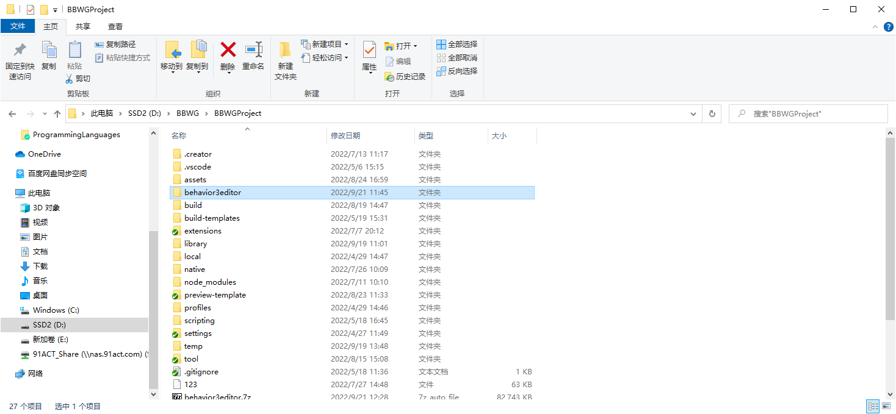
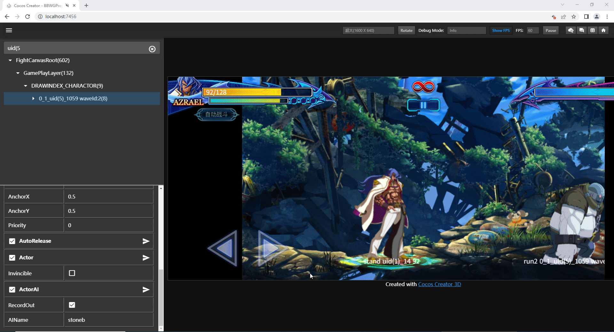

# README_91Act

## 相较原版修改的功能

- 与 cocos creator 的数据互通，支持实时修改运行时数据；
- boolean 字段默认不是必须的；
- 将常量参数的标题（字段名）和帮助内容（辅助解释字段功能）分开显示；
- 调整调试信息的展示；
- 修复保存、撤销、重做视口被重置的问题；

## 项目内部署注意事项

1. 需保留本地端口4444未被占用；
2. 出包后需要将包内容放置在如下图所示位置；

3. cocos 项目内需要开启对应功能，并导出项目内配置到 editor 内，具体步骤如下；

## 功能使用示例

以 cocos creator 工程为示例

1. 实时展示运行时数据

2. 实时修改运行时常量参数

3. 实时修改运行中的行为树

